# NetZeroCarbon — Entrypoints & User Journeys

> Architecture diagrams for the full NetZeroCarbon codebase. Any developer joining the project should be able to read this document and understand every way a user or external system can enter the application, what happens next, and where data goes.

---

## 1. System Architecture Overview

```mermaid
flowchart TB
    subgraph External["🌐 External Systems"]
        LINE["LINE Platform<br/>(OA, LIFF, Messaging API)"]
        Farmer["Farmer Mobile<br/>(LINE App + LIFF WebView)"]
        Browser["Admin / Sponsor Browser"]
    end

    subgraph Workers["☁️ Cloudflare Workers (Hono)"]
        subgraph Entrypoints["Entrypoints"]
            Webhook["POST /webhook/line<br/>LINE Messaging API"]
            LIFFApp["GET /liff/<br/>LIFF Chat App"]
            LIFFReg["GET /register<br/>LIFF Registration Form"]
            LIFFCam["GET /liff/camera<br/>LIFF Camera"]
            LIFFDocs["GET /liff/documents<br/>LIFF Document Upload"]
            WebAdmin["GET /admin/*<br/>Admin Console"]
            WebSponsor["GET /sponsor/*<br/>Sponsor Portal"]
            WebAuth["GET /login<br/>Admin Login"]
            Health["GET /health"]
            Export["GET /export/*"]
        end

        subgraph Routes["Route Modules"]
            flow["src/line/flow.ts<br/>State Machine"]
            reply["src/line/reply.ts<br/>LINE Push/Reply"]
            admin["src/routes/admin.ts"]
            sponsor["src/routes/sponsor.ts"]
            liff["src/routes/liff.ts"]
            auth["src/routes/auth.ts"]
            dashboard["src/routes/dashboard.ts"]
            photo["src/routes/photo.ts"]
            season["src/routes/season.ts"]
            farmer["src/routes/farmer.ts"]
            export["src/routes/export.ts"]
        end

        subgraph Infra["Infrastructure"]
            D1["🗄️ Cloudflare D1<br/>(SQLite — farmers, plots,<br/>photos, users, sessions)"]
            R2["📦 Cloudflare R2<br/>(Photos: evidence/{id}.jpg<br/>Docs: docs/{farmerId}/{code}/*)"]
            OpenRouter["🤖 OpenRouter API<br/>(Qwen 3.6 Flash — AI chat)"]
        end
    end

    LINE --> Webhook
    Farmer --> LIFFApp
    Farmer --> LIFFReg
    Farmer --> LIFFCam
    Farmer --> LIFFDocs
    Browser --> WebAdmin
    Browser --> WebSponsor
    Browser --> WebAuth

    Webhook --> flow
    flow --> reply
    reply --> LINE

    LIFFApp --> liff
    LIFFReg --> liff
    LIFFCam --> liff
    LIFFDocs --> liff
    liff --> flow
    flow --> D1
    flow --> OpenRouter

    admin --> D1
    admin --> R2
    sponsor --> D1
    dashboard --> D1
    photo --> D1
    photo --> R2
    farmer --> D1
    export --> D1

    LIFFApp -.-> LINE
    LIFFReg -.-> LINE
```

---

## 2. All Entrypoints by Surface

### 2A. Farmer — LINE OA & LIFF

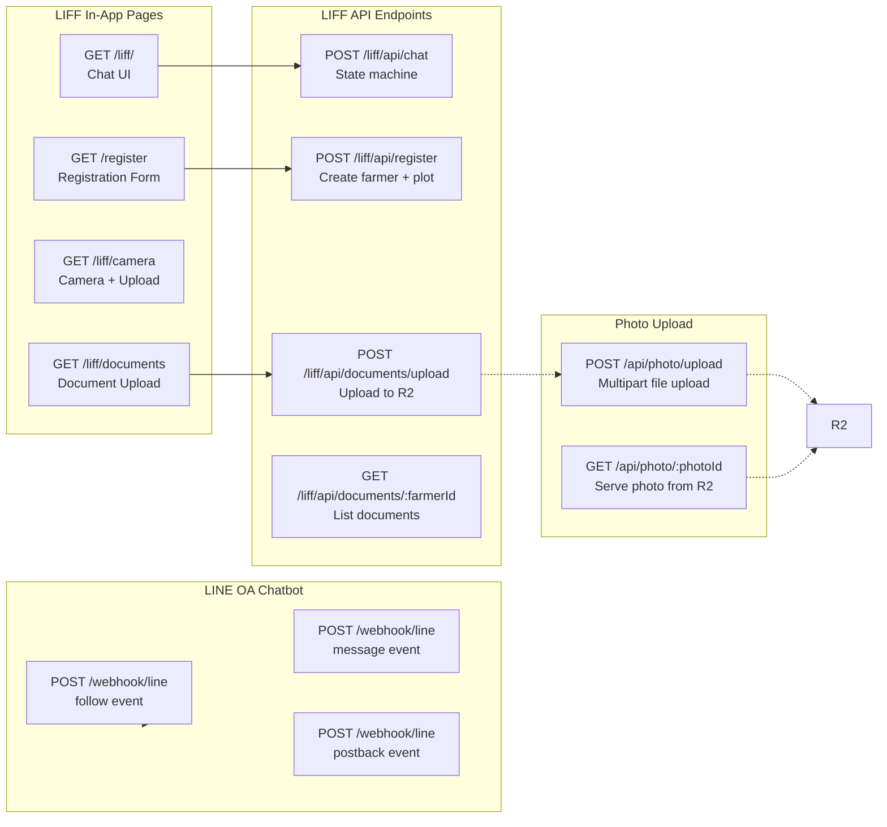

### 2B. Admin — Browser Console

```mermaid
flowchart LR
    subgraph Auth["Auth"]
        Login["GET /login<br/>Login page"]
        LoginPOST["POST /login<br/>Email + password + OTP"]
        Logout["POST /logout"]
        Redirect["GET /redirect"]
    end

    subgraph Admin_UI["Admin HTML Pages"]
        A1["GET /admin<br/>Dashboard shell"]
        A2["GET /admin/overview<br/>KPI + work queue"]
        A3["GET /admin/applications<br/>Application queue"]
        A4["GET /admin/review<br/>Photo review queue"]
        A5["GET /admin/farmers<br/>Farmer list"]
        A6["GET /admin/farmers/:id<br/>Farmer detail"]
        A7["GET /admin/audit/:photoId<br/>Decision history"]
        A8["GET /admin/sponsors<br/>Sponsor management"]
        A9["GET /admin/reports<br/>Report catalogue"]
        A10["GET /admin/settings<br/>System settings"]
    end

    subgraph Admin_API["Admin JSON APIs"]
        API1["GET /api/admin/farmers"]
        API2["POST /api/admin/farmers<br/>Create farmer"]
        API3["GET /api/admin/farmers/:id"]
        API4["POST /api/admin/applications<br/>List applications"]
        API5["POST /api/admin/applications/:id/approve"]
        API6["POST /api/admin/applications/:id/reject"]
        API7["POST /api/admin/applications/:id/hold"]
        API8["GET /api/admin/review"]
        API9["POST /api/admin/review/:photoId<br/>Verify / Reject photo"]
        API10["GET /api/admin/overview/kpis"]
        API11["GET /api/admin/overview/credit-chart"]
        API12["GET /api/admin/overview/ghg-sources"]
        API13["GET /api/admin/dashboard"]
        API14["GET /api/photo/:photoId"]
    end

    Auth --> Login --> LoginPOST
    Admin_UI --> Admin_API
    Admin_API --> D1
    Admin_API --> R2
```

### 2C. Sponsor — Browser Portal

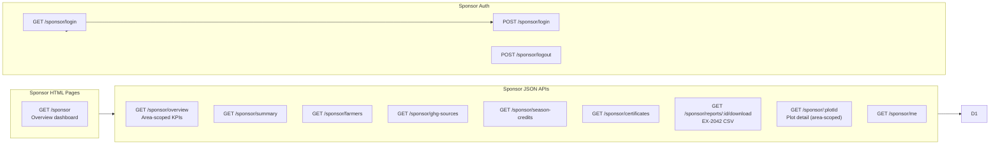

---

## 3. LINE Conversation State Machine

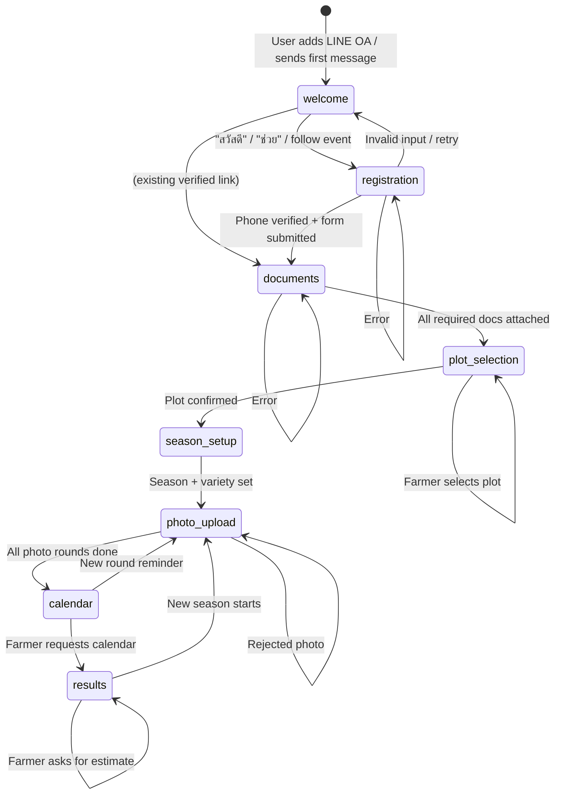

---

## 4. Journey 1 — Farmer Registers via LINE OA

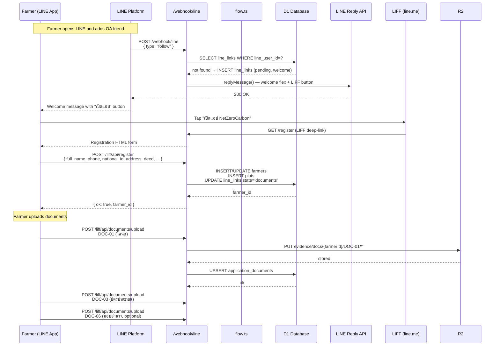

---

## 5. Journey 2 — Farmer Chats with Bot

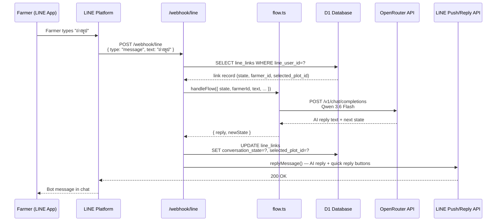

---

## 6. Journey 3 — Farmer Takes Photo via LIFF Camera

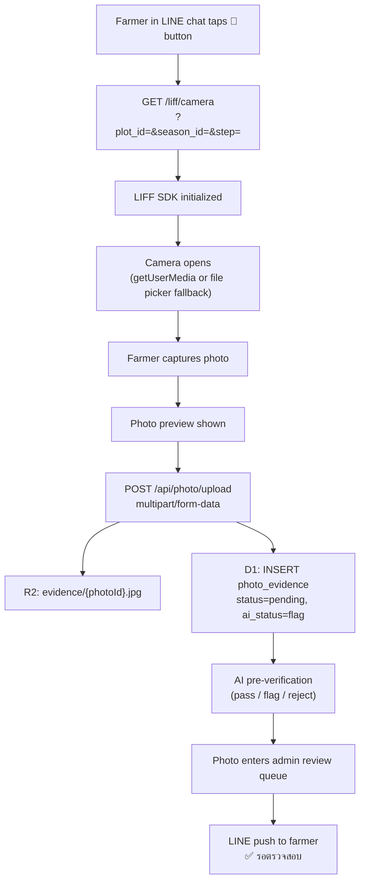

---

## 7. Journey 4 — Admin Reviews Application

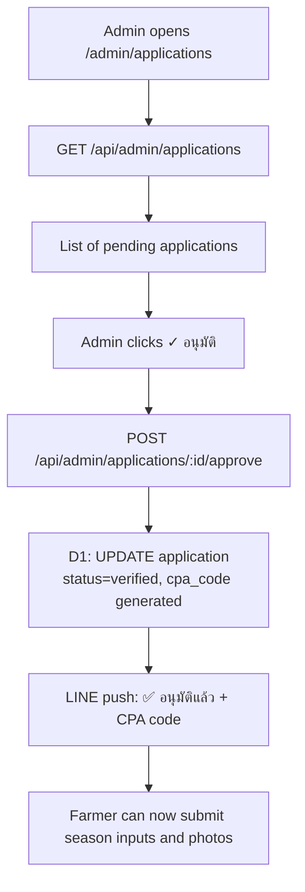

---

## 8. Journey 5 — Admin Reviews Photo

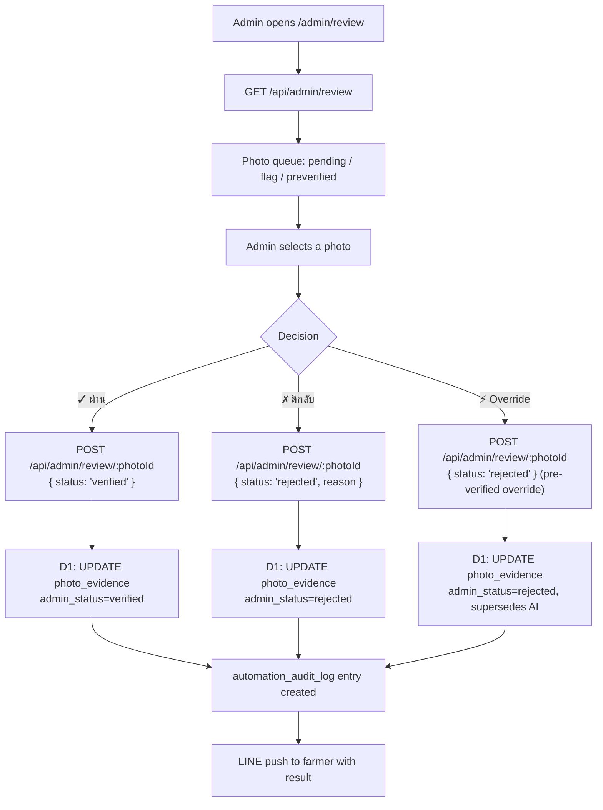

---

## 9. Journey 6 — Sponsor Views Carbon Impact

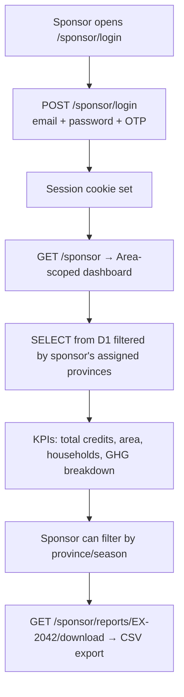

---

## 10. Route Mount Order (src/index.ts)

```mermaid
flowchart BT
    subgraph Order["app.route() Registration Order"]
        O1["1. /register<br/>(inline — must be first)"]
        O2["2. /liff/*<br/>(liffRoutes — LIFF pages + APIs)"]
        O3["3. /<br/>(authRoutes — login/logout)"]
        O4["4. /health<br/>(healthRoutes)"]
        O5["5. /api/photo<br/>(photoRoutes)"]
        O6["6. /api/season<br/>(seasonRoutes — admin-gated POST)"]
        O7["7. /api/farmer<br/>(farmerRoutes)"]
        O8["8. /webhook/line<br/>(inline — GET verify, POST events)"]
        O9["9. /admin/*<br/>(adminRoutes — session-protected)"]
        O10["10. /sponsor/*<br/>(sponsorRoutes — session-protected)"]
        O11["11. /export/*<br/>(exportRoutes)"]
        O12["12. /<br/>(dashboardRoutes — catch-all shells)"]
    end

    Note_N["Why order matters: Hono matches first registered route.<br/>/register must be before sub-routers so it is not caught by them."]
```

---

## 11. Data Storage Map

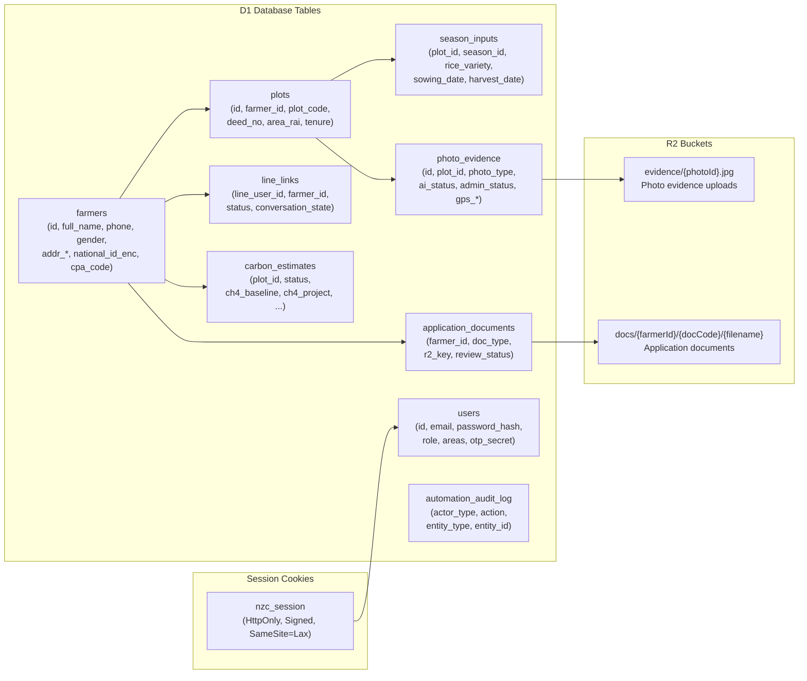

---

## 12. Security Boundaries

```mermaid
flowchart TB
    subgraph LB1["LINE Webhook"]
        W1["POST /webhook/line"]
        W1 --> SIG["X-Line-Signature<br/>HMAC-SHA256 verified"]
        SIG -->|invalid| W2["401 Unauthorized"]
        SIG -->|valid| W3["Process event"]
    end

    subgraph Admin_Auth["Admin Auth Middleware"]
        A1["requireRole('admin', SECRET)"]
        A1 --> A2{"Valid session cookie?"}
        A2 -->|no| A3["401 Unauthorized"]
        A2 -->|yes| A4["Role = admin?"]
        A4 -->|no| A5["403 Forbidden"]
        A4 -->|yes| A6["Proceed"]
    end

    subgraph Sponsor_Auth["Sponsor Auth Middleware"]
        S1["requireRole('sponsor', SECRET)"]
        S1 --> S2{"Valid session cookie?"}
        S2 -->|no| S3["401 Unauthorized"]
        S2 -->|yes| S4["Role = sponsor?"]
        S4 -->|no| S5["403 Forbidden"]
        S4 -->|yes| S6["Area-scope filter<br/>every query filtered by assigned provinces"]
    end

    subgraph Season_Write["Season Write Protection"]
        SE1["POST /api/season"]
        SE2["POST /api/season/approve"]
        SE1 --> SE3{"Admin session?"}
        SE2 --> SE3
        SE3 -->|no| SE4["401/403"]
        SE3 -->|yes| SE5["Proceed"]
    end
```

---

## 13. External Service Configuration

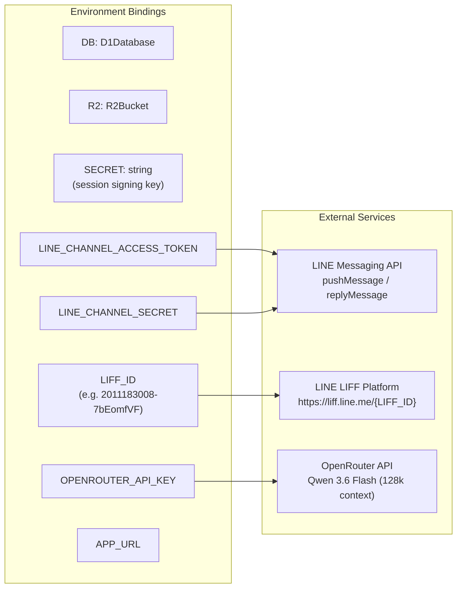

---

## 14. Entrypoint Quick-Reference Table

| Surface | Method | Path | Auth | Description |
|---------|--------|------|------|-------------|
| **LINE** | POST | `/webhook/line` | X-Line-Signature | All LINE events (follow, message, postback) |
| **LIFF** | GET | `/liff/` | LIFF SDK | Chat UI |
| **LIFF** | GET | `/register` | LIFF SDK | Registration form |
| **LIFF** | GET | `/liff/camera` | LIFF SDK | Camera + photo upload |
| **LIFF** | GET | `/liff/documents` | LIFF SDK | Document upload UI |
| **LIFF** | POST | `/liff/api/chat` | userId in body | State machine API |
| **LIFF** | POST | `/liff/api/register` | userId in body | Farmer registration |
| **LIFF** | POST | `/liff/api/documents/upload` | userId in body | Document file upload |
| **Photo** | POST | `/api/photo/upload` | None | Photo evidence upload |
| **Admin** | GET | `/login` | None | Login page |
| **Admin** | POST | `/login` | Form | Authenticate |
| **Admin** | GET | `/admin` | Session cookie | Dashboard shell |
| **Admin** | GET | `/admin/*` | Session cookie | All admin HTML pages |
| **Admin** | GET/POST | `/api/admin/*` | Session cookie | All admin APIs |
| **Admin** | POST | `/api/photo/upload` | Session cookie | Photo review action |
| **Admin** | POST | `/api/admin/farmers` | Session cookie | Create farmer (rate-limited) |
| **Sponsor** | GET | `/sponsor/login` | None | Sponsor login page |
| **Sponsor** | POST | `/sponsor/login` | Form | Sponsor authenticate |
| **Sponsor** | GET | `/sponsor/*` | Session cookie | All sponsor routes (area-scoped) |
| **System** | GET | `/webhook/line` | None | LINE webhook verification (200 OK) |
| **System** | GET | `/health` | None | Health check |
| **System** | GET | `/export/*` | — | Data export |
