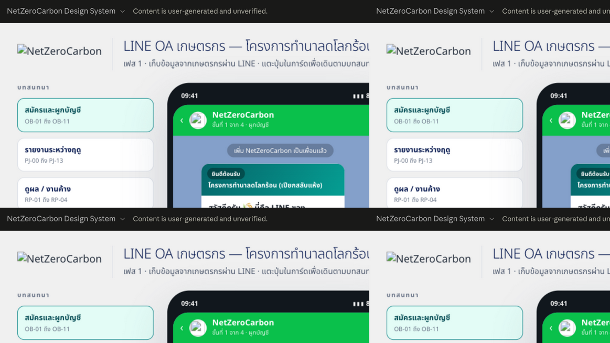
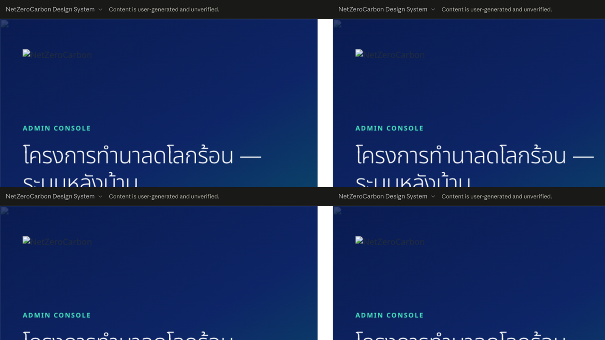
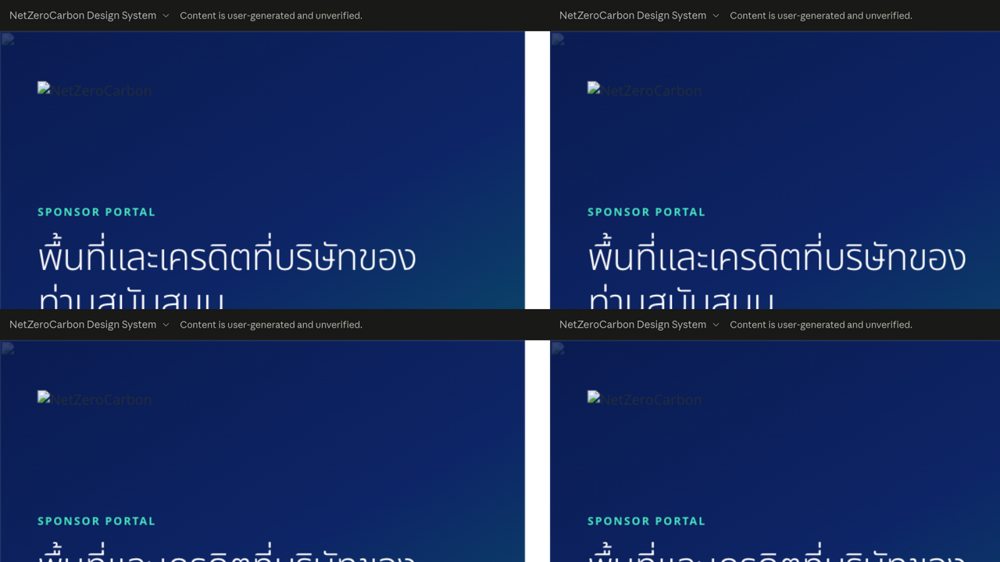

# Client Design Reference Screenshots

Captured from the client-provided Claude Design artifacts on 2026-09-14.

These images are **visual baselines**, not implementation screenshots. Compare the actual target surface against the relevant image and the source requirements in `REQUIREMENTS.md`.

## LINE OA for Farmers

**Artifact:** https://claude.ai/code/artifact/19c446b9-e2f5-4e09-a118-fca56ec0c0c8

Reference file: [`design-line-oa-full.png`](./design-line-oa-full.png)

Important: compare this design against the **real LINE OA experience** (LINE webhook responses, Flex Messages, Rich Menu, and LIFF pages), not the web `/chat` demo.

## Admin Console

**Artifact:** https://claude.ai/code/artifact/161f2305-35de-42f8-83ed-7c90ab4da5a6

Reference file: [`design-admin-full.png`](./design-admin-full.png)

## Sponsor Dashboard

**Artifact:** https://claude.ai/code/artifact/0de23b7a-9fb3-433e-8930-7eff56a39e45

Reference file: [`design-sponsor-full.png`](./design-sponsor-full.png)

## Capture Notes

- Screenshots were captured from the rendered artifact frame at the default 1280×720 browser viewport.
- The Claude artifact wrapper repeats the frame in the viewport; the source payload remains the authoritative source for all states and content.
- For 100% design matching, use both this image baseline and the extracted source files/requirements.
- A screenshot match alone is insufficient: verify all interactive states, data, transitions, privacy boundaries, and error states.
